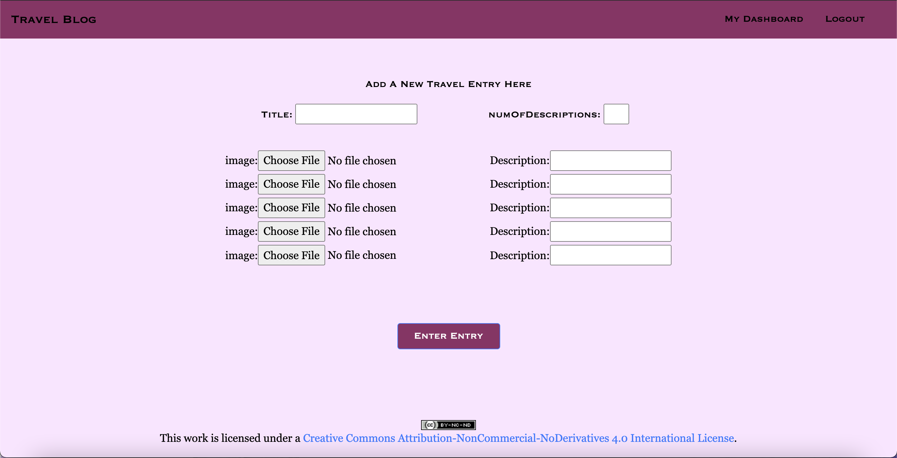

# TravelBlog 
## Developed by Fabliha Hossain
### A Django Project Implemented with a PostgreSQL Backend

**Project Objective:** After discovering and implementing websites with Python Flask, I wanted to see how it compares to the Django Web Framework. This particular site allows users to share their travel journies with other travelors around the world.

**Login Demo:** The following gif shows the initial welcome page that provides routes to the login and resgister pages. Once a user logs in with their credentials, the welcome page is updated to show a menu of options that the user can engage in. In a potential future version of this site, the user can be able to have a page dedicated to view and their own entries.

**Homepage:** The homepage of the site showcases all the entries that all the users have uploaded while using the site. It is currently in chronological order, the latest entry is shown at the beginning. In potential future versions, the entry card can include the date that it has been uploaded on.

**Entry Display Demo:** The following gif shows an example of a travel entry, with a carousel to display the images and their respective descriptions. The user can either utilize the previous and next arrow buttons to go through the images, or let the carousel automatically scroll through them.

**Registration Page:** The standard register page simply asks for name, email, username, and password. Error handling is implemented to prevent multiple users having the same username.

**New Entry Page:** This screenshot shows the form that a user must fill out in order to submit their entry to the site. In this devleopmental environment, the user can upload up to 5 images per entry. Proper error handling is implemented to ensure that the number of descriptions match the number of images uploaded (and vice versa).

###### Technology Decisions:
* Django
* PostgreSQL 
* Javascript
	* Bootstrap 4.5
* HTML

**License Info:** This work is licensed under a *Creative Commons Attribution-NonCommercial-NoDerivatives 4.0 International License*
https://creativecommons.org/licenses/by-nc-nd/4.0/